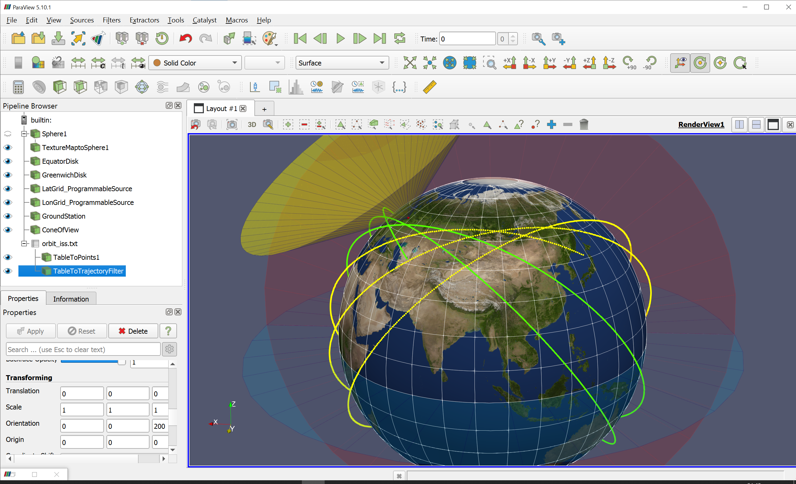

# Paraview Orbit Visualization

## Описание



Шаблон проекта ParaView для трёхмерной визуализации баллистической информации (траектории космических аппаратов, области видимости, Земля). Единицы измерения - километры. На данный момент доступна только сферическая фигура Земли (эллипсоид в процессе проработки).

* `ParaviewOrbit.pvsm` - файл проекта ParaView 5.10.1, Windows 10.
  * `TextureMaptoSphere1` - текстура Земли
  * `EquatorDisk` - условный диск экватора (`Disk Source`)
  * `GreenwichDisk` - условный диск гринвичского меридиана (`Disk Source`)
  * `LatGrid_ProgrammableSource` - скрипт для отображения сетки координат по широте
  * `LonGrid_ProgrammableSource` - скрипт для отображения сетки координат по долготе
  * `GroundStation` - обозначение наземного пункта (`Sphere Source`)
  * `ConeOfView` - поле обзора наземного пункта  (`Cone Source`)
  * `TableToPoints` - фильтр, визуализирующий таблицу с точками траектории как цепочку точек
  * `TableToTrajectoryFilter` - фильтр, визуализирующий таблицу с точками траектории как линию (`Programmable Filter`)
* `8k_earth_daymap.jpg` - текстура Земли в равнопромежуточной картографической проекции (Equirectangular projection), [источник commons.wikimedia.org](https://commons.wikimedia.org/wiki/File:Solarsystemscope_texture_8k_earth_daymap.jpg)
* `latitude_grid_source.py` - файл кода Python для `LatGrid_ProgrammableSource`
* `longitude_grid_source.py` - файл кода Python для `LonGrid_ProgrammableSource`
* `orbit_iss.txt` - файл с точками траектории без привязки к параметрам какого-то конкретного КА
* `table_to_trajectory_filter.py`- файл кода Python для `TableToTrajectoryFilter`

## Инструкция

### 1. Отображение траектории

1. Загрузить файл, содержащий ранее полученные точки траектории спутника, в проект (`File → Open`). Файл в любом формате, который может распарсить ParaView (CSV, TXT и др.).
2. Для визуализации точек траектории
  * выбрать загруженную таблицу данных (п.1) в дереве проекта,
  * назначить ей фильтр `TableToPoints`, в котором задать размер и цвет точек, цвет, прозрачность, и другие параметры отображения.
3. Для отображения линии или трубки траектории
  * выбрать загруженную таблицу данных (п.1) в дереве проекта,
  * назначить ей фильтр `ProgrammableFilter`,
  * в поле `Script` в настройках фильтра ввести код из файла `table_to_trajectory_filter.py`.

### 2. Отображение наземного пункта и зоны видимости

1. Создать точку (`Sources → Sphere`) с геоцентрическими координатами наземной станции в АГСК. Для сферической Земли координаты рассчитываются на основе широты и долготы:
    ```python
    from math import sin, cos, radians
    EARTH_RADIUS_KM = 6371.0
    latitude_deg = ...
    longitude_deg = ...
    x = EARTH_RADIUS_KM * cos(radians(longitude_deg)) * cos(radians(latitude_deg))
    y = EARTH_RADIUS_KM * sin(radians(longitude_deg)) * cos(radians(latitude_deg))
    z = EARTH_RADIUS_KM * sin(radians(latitude_deg))
    ```
2. Создать конус зоны видимости (`Sources → Cone`)
  * задать ему `Height` и `Radius` в соответствии с шириной (углом) поля обзора,
  * задать тройку смещений `Center`: `[Height/2, 0, 0]`,
  * задать `Direction` `[-1, 0, 0]`,
  * задать в Translation те же координаты, которые указывались при создании сферы - наземного пункта,
  * задать в Orientation `[0, -широта, долгота]`.

### 3. Настройка окружения

1. Для загрузки другой текстуры Земли выбрать в дереве проекта элемент `TextureMaptoSphere1`, в расширенных настройках `Lightning -> Texture` выбрать свой файл текстуры. Для корректного отображения
  * текстура должна отображать поверхность Земли в равнопромежуточной картографической проекции   (Equirectangular projection),
  * в расширенных настройках элемента `TextureMaptoSphere1` в   разделе `Properties` выключить `Prevent Seam`,
  * в расширенных настройках элемента `TextureMaptoSphere1` в   разделе `Lightning` выставить включить `Seamless U`.
  * Открытые текстуры Земли можно найти на
    * https://www.solarsystemscope.com/textures/
    * https://visibleearth.nasa.gov/
2. Для включения/выключения плоскости экватора и гринвичского меридиана нажать на "глаз" в дереве проекта (`Pipeline browser`).

---

## Description

ParaView template project for orbital 3D data visualization (spacecraft orbits, trajectory points, ground stations, fields of view, Earth). Distance units - kilometers. Only spherical Earh is presented by now (ellipsoid is in progress).

* `ParaviewOrbit.pvsm` - ParaView project file (Paraview 5.10.1, Windows 10).
  * `TextureMaptoSphere1` - Earth texture
  * `EquatorDisk` - visible equator plane (`Disk Source`)
  * `GreenwichDisk` - visible greenwich meridian plane (`Disk Source`)
  * `LatGrid_ProgrammableSource` - python script for latitudes grid display (`Programmable Source`)
  * `LonGrid_ProgrammableSource` - python script for longitude grid display  (`Programmable Source`)
  * `GroundStation` - ground station mark (`Sphere Source`)
  * `ConeOfView` - ground station cone of view  (`Cone Source`)
  * `TableToPoints` - filter for display table data as points
  * `TableToTrajectoryFilter` - filter for display table data as polyline/trajectory (`Programmable Filter`)
* `8k_earth_daymap.jpg` - Earth texture in equirectangular projection, [source commons.wikimedia.org](https://commons.wikimedia.org/wiki/File:Solarsystemscope_texture_8k_earth_daymap.jpg)
* `latitude_grid_source.py` - python code for `LatGrid_ProgrammableSource`
* `longitude_grid_source.py` - python code for `LonGrid_ProgrammableSource`
* `orbit_iss.txt` - some random spacecraft trajectory points just for example
* `table_to_trajectory_filter.py`- python code for `TableToTrajectoryFilter`

## Manual

    <in progress...>

### 1. Trajectory visualization

    <in progress...>

### 2. Ground station field of view visualization

    <in progress...>

### 3. Scene setup

    <in progress...>
